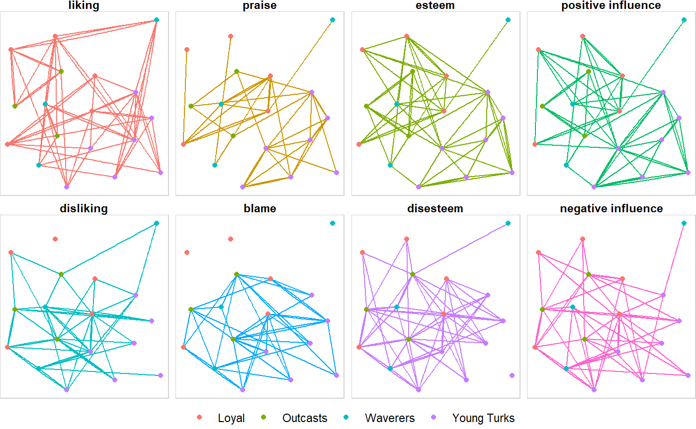

<!-- README.Rmd generates README.md. -->

# snatools <a href="http://res.cloudinary.com/syknapptic/image/upload/v1537658876/logo_bnrvvg.png">  </a>

[](https://www.tidyverse.org/lifecycle/#experimental)
[](https://travis-ci.org/knapply/snatools)
[](https://codecov.io/gh/knapply/snatools)

<!-- [](https://github.com/knapply/snatools) -->

## Overview

`snatools` is still *very* experimental; the current API and
dependencies are subject to change.

`snatools` has four immediate goals:

1.  Accurately bridge existing graph frameworks (i.e. `igraph` and
    `network`).
2.  Streamline network analytic workflows by making common tasks as
    intuitive (and stable) as possible.
      - Increase analyst efficiency.
      - Reduce the cognitive load of network newcomers and those
        instructing them.
3.  Implement metrics that are missing from R’s network ecosystem.
      - Reimplement those that *should* be made more accessible,
        efficient, or robust.
4.  Standardize fundamental tasks with methods that bypass the
    longstanding issues of `igraph` vs `network` namespace
conflicts.

<!-- Additionally, `snatools` seeks to prepare for the future by establishing the foundation (or a set of lessons-learned) for an enhanced network framework that: -->

<!-- 1. continues to be compatible with legacy frameworks. -->

<!-- 2. can be extended to take advantage of modern and future R's ecosystem . -->

<!--     + Optimization? `Rcpp`, C++'s Boost Graph Library, Python's graph-tool (heavily C++), CUDA -->

<!--     + Data Frame Efficiency? `data.table` -->

<!--     + Spatial Vector Data? `sf` -->

<!--     + Intuitive Code? `tidyverse`  -->

<!--         + `tidygraph` and `ggraph` may still be maturing, but they've rendered many legacy workflows for graph manipulation and plotting obsolete. -->

<!--     + Next Generation Tools? [Apache Arrow](https://arrow.apache.org/) is coming. -->

## Installation

``` r
# Install {devtools} if you haven't already.
# install.packages("devtools")
requireNamespace(devtools)

# Install {snatools} from GitHub.
devtools::install_github("knapply/snatools")

# Load {snatools}.
library(snatools)
```

## Features

``` r
data("sampson_monastery")
```

### `bridge_net`

The `bridge_net` object provides an intermediate graph structure that
can effectively map data to both `igraph` and `network` objects.

``` r
sampson_monastery
#> # A directed, multiplex, 1-mode `bridge_net`.
#> # - Contains 0 loops and 0 isolates.
#> $edges # first 3 of 510
#>    .ego    .alter  weight relation time  positive_relation
#>    <.name> <.name> <dbl>  <chr>    <int> <lgl>            
#>  | Romauld Ambrose 2      liking   1     TRUE             
#>  | Romauld Peter   3      liking   1     TRUE             
#>  | Romauld Albert  1      liking   1     TRUE             
#> $vertices # first 3 of 18
#>    .name       faction  cloisterville status  
#>    <.name>     <chr>    <lgl>         <chr>   
#>  | Romauld     Waverers FALSE         Remained
#>  | Bonaventure Loyal     TRUE         Remained
#>  | Ambrose     Loyal    FALSE         Remained
```

### Conversion

Through `bridge_net` objects, `igraph` and `network` objects can play
together easier than ever.

``` r
ig <- as_igraph(sampson_monastery)
```

    #> IGRAPH 1bbbb61 DNW- 18 510 -- 
    #> + attr: network_name (g/c), author (g/c), name (v/c), faction
    #> | (v/c), cloisterville (v/l), status (v/c), weight (e/n), relation
    #> | (e/c), time (e/n), positive_relation (e/l)
    #> + edges from 1bbbb61 (vertex names):
    #>  [1] Romauld    ->Ambrose     Romauld    ->Peter      
    #>  [3] Romauld    ->Albert      Bonaventure->Romauld    
    #>  [5] Bonaventure->Victor      Bonaventure->Albert     
    #>  [7] Ambrose    ->Romauld     Ambrose    ->Bonaventure
    #>  [9] Ambrose    ->Elias       Berthold   ->Peter      
    #> [11] Berthold   ->Louis       Berthold   ->Gregory    
    #> + ... omitted several edges

``` r
nw <- as_network(sampson_monastery)
```

    #>  Network attributes:
    #>   vertices = 18 
    #>   directed = TRUE 
    #>   hyper = FALSE 
    #>   loops = FALSE 
    #>   multiple = TRUE 
    #>   bipartite = FALSE 
    #>   network_name = Crisis in the Cloister 
    #>   author = Samuel F. Sampson 
    #>   total edges= 510 
    #>     missing edges= 0 
    #>     non-missing edges= 510 
    #> 
    #>  Vertex attribute names: 
    #>     cloisterville faction status vertex.names 
    #> 
    #>  Edge attribute names: 
    #>     positive_relation relation time weight

``` r
as_network(ig)
#>  Network attributes:
#>   vertices = 18 
#>   directed = TRUE 
#>   hyper = FALSE 
#>   loops = FALSE 
#>   multiple = TRUE 
#>   bipartite = FALSE 
#>   network_name = Crisis in the Cloister 
#>   author = Samuel F. Sampson 
#>   total edges= 510 
#>     missing edges= 0 
#>     non-missing edges= 510 
#> 
#>  Vertex attribute names: 
#>     cloisterville faction status vertex.names 
#> 
#>  Edge attribute names: 
#>     positive_relation relation time weight
```

``` r
as_igraph(nw)
#> IGRAPH 1bf4345 DNW- 18 510 -- 
#> + attr: network_name (g/c), author (g/c), name (v/c), faction
#> | (v/c), cloisterville (v/l), status (v/c), weight (e/n), relation
#> | (e/c), time (e/n), positive_relation (e/l)
#> + edges from 1bf4345 (vertex names):
#>  [1] Romauld    ->Ambrose     Romauld    ->Peter      
#>  [3] Romauld    ->Albert      Bonaventure->Romauld    
#>  [5] Bonaventure->Victor      Bonaventure->Albert     
#>  [7] Ambrose    ->Romauld     Ambrose    ->Bonaventure
#>  [9] Ambrose    ->Elias       Berthold   ->Peter      
#> [11] Berthold   ->Louis       Berthold   ->Gregory    
#> + ... omitted several edges
```

#### `%==%`

Since `bridge_net`s are intermediate structures, comparing them is easy.
`%==%` streamlines the process to make successful conversion
confirmation as simple as possible.

``` r
all(ig %==% nw,
    ig %==% sampson_monastery,
    nw %==% sampson_monastery)
#> [1] TRUE
```

The only data that are not compared by `%==%` are non-structural
attributes as `igraph` and `network` do not handle them in compatible
ways.

``` r
ig %>% igraph::graph_attr_names()
#> [1] "network_name" "author"
nw %>% network::list.network.attributes()
#> [1] "author"       "bipartite"    "directed"     "hyper"       
#> [5] "loops"        "mnext"        "multiple"     "n"           
#> [9] "network_name"
```

### Standardized Data Extraction

``` r
ig %>% vrt_to_df()
#>          .name     faction cloisterville           status
#> 1      Romauld    Waverers         FALSE         Remained
#> 2  Bonaventure       Loyal          TRUE         Remained
#> 3      Ambrose       Loyal         FALSE         Remained
#> 4     Berthold       Loyal         FALSE         Remained
#> 5        Peter       Loyal          TRUE         Remained
#> 6        Louis       Loyal         FALSE         Remained
#> 7       Victor    Waverers         FALSE         Remained
#> 8      Winfrid Young Turks         FALSE         Remained
#> 9   John Bosco Young Turks          TRUE Left Voluntarily
#> 10     Gregory Young Turks          TRUE         Expelled
#> 11        Hugh Young Turks         FALSE Left Voluntarily
#> 12    Boniface Young Turks         FALSE Left Voluntarily
#> 13        Mark Young Turks          TRUE Left Voluntarily
#> 14      Albert Young Turks         FALSE Left Voluntarily
#> 15       Amand    Waverers         FALSE         Remained
#> 16       Basil    Outcasts          TRUE         Expelled
#> 17       Elias    Outcasts         FALSE         Expelled
#> 18  Simplicius    Outcasts         FALSE         Expelled
```

``` r
nw %>% edg_to_df()
#> # edge_data_frame: 510 x 6
#>             .ego      .alter weight relation time positive_relation
#>   1      Romauld     Ambrose      2   liking    1              TRUE
#>   2      Romauld       Peter      3   liking    1              TRUE
#>   3      Romauld      Albert      1   liking    1              TRUE
#>   4  Bonaventure     Romauld      3   liking    1              TRUE
#>   5  Bonaventure      Victor      2   liking    1              TRUE
#>   6  Bonaventure      Albert      1   liking    1              TRUE
#>   7      Ambrose     Romauld      2   liking    1              TRUE
#>   8      Ambrose Bonaventure      3   liking    1              TRUE
#>   9      Ambrose       Elias      1   liking    1              TRUE
#>   10    Berthold       Peter      3   liking    1              TRUE
#>   # ... with 500 additional rows.
```

### Standardized Representations

``` r
ig %>% rep_as_edgelist()
#> # A directed edgelist with 510 edges.*
#>    .ego        .alter     
#> 1  Romauld     Ambrose    
#> 2  Romauld     Peter      
#> 3  Romauld     Albert     
#> 4  Bonaventure Romauld    
#> 5  Bonaventure Victor     
#> 6  Bonaventure Albert     
#> 7  Ambrose     Romauld    
#> 8  Ambrose     Bonaventure
#> 9  Ambrose     Elias      
#> 10 Berthold    Peter      
#> # ... and 500 more row(s).
#> # * Values correspond to vertex names.
```

### Additional Tools

``` r
nw %>% rep_as_mixing_matrix(vrt_attr = "faction")
#> # A mixing_matrix with 4 attribute categories.
#>                .alter
#> .ego             Loyal Outcasts Waverers Young Turks     Incoming Ties
#>   Loyal          40    32       21       46            | 139          
#>   Outcasts       31    18       18       18            | 85           
#>   Waverers       30    12       5        23            | 70           
#>   Young Turks    54    41       32       89            | 216          
#>                  -     -        -        -                            
#>   Outgoing Ties  155   103      76       176
```

### Easy Integeration with Modern Workflows

``` r
library(tidygraph, warn.conflicts = FALSE)
library(ggraph, quietly = TRUE)

nw %>% 
  as_igraph() %>% 
  as_tbl_graph() %E>%
  select(time, relation) %>% 
  filter(time == 3) %>%
  mutate(relation = factor(relation, 
                           c("liking", "praise", "esteem", "positive influence",
                             "disliking", "blame", "disesteem", "negative influence"))
        ) %>% 
  ggraph() +
  geom_edge_fan(aes(colour = relation), width = 0.5, show.legend = FALSE) +
  geom_node_point(aes(colour = faction)) +
  guides(edge_colour = guide_legend(title = NULL),
         colour = guide_legend(title = NULL)) +
  facet_edges(~ relation, ncol = 4) +
  theme_void() +
  theme(strip.text = element_text(face = "bold", vjust = 1),
        panel.border = element_rect(fill = NA, color = "lightgray"),
        legend.position = "bottom")
```



<!-- # Development Tests -->

<!-- ```{r, message=FALSE} -->

<!-- # devtools::test() -->

<!-- ``` -->

``` r
covr::package_coverage()
#> snatools Coverage: 54.30%
#> R/adjacency-matrix.R: 0.00%
#> R/ei_index.R: 0.00%
#> R/ggplot.R: 0.00%
#> R/global-metrics.R: 0.00%
#> R/mixing-matrix.R: 0.00%
#> R/txt_.R: 20.00%
#> R/as_bridge_net.R: 29.17%
#> R/utils.R: 32.58%
#> R/edgelist.R: 43.42%
#> R/network-metadata.R: 55.67%
#> R/utils-attributes.R: 62.50%
#> R/operators.R: 63.64%
#> R/vertex-attributes.R: 72.77%
#> R/as_network.R: 76.19%
#> R/edge-attributes.R: 76.51%
#> R/as_igraph.R: 81.25%
#> R/network-attributes.R: 84.85%
#> R/build_test_graph.R: 90.68%
```
